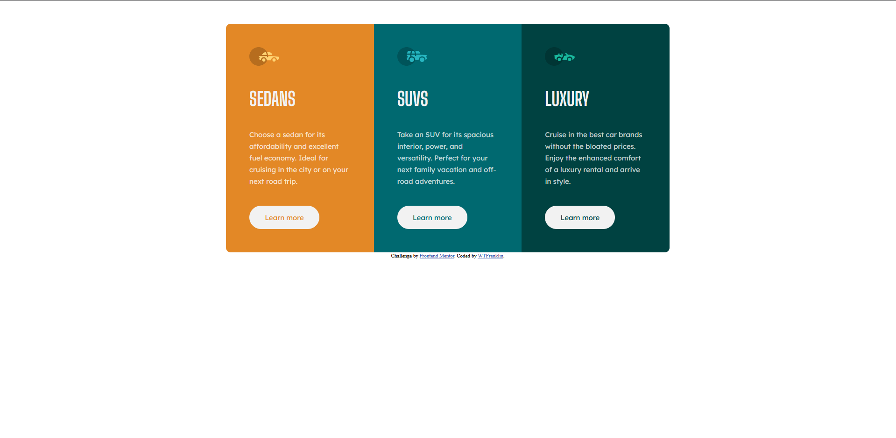

# Frontend Mentor - 3-column preview card component solution

This is a solution to the [3-column preview card component challenge on Frontend Mentor](https://www.frontendmentor.io/challenges/3column-preview-card-component-pH92eAR2-). Frontend Mentor challenges help you improve your coding skills by building realistic projects. 

## Table of contents

- [Overview](#overview)
  - [Screenshot](#screenshot)
  - [Links](#links)
- [My process](#my-process)
  - [Built with](#built-with)
  - [What I learned](#what-i-learned)
  - [Continued development](#continued-development)
- [Author](#author)

## Overview
This is my solution to the challenge to create a 3-column preview card component.

### Screenshot

Screen shot of my solution

### Links

- Solution URL: [Solution Repo](https://github.com/frankaddelia/three-column-layout-component)
- Live Site URL: [Live site](https://frankaddelia.github.io/three-column-layout-component/)

## My process

I started with structuring the HTML markup and then used CSS once everything was in place.

### Built with

- Semantic HTML5 markup
- CSS custom properties
- Flexbox
- Mobile-first workflow
- [SASS](https://sass-lang.com/)

### What I learned

I made sure to apply semantic html 5 to the markup since I've been taking a deeper dive into what that means and focused on not mixing 
and matching html 4/xhtml standards with semantic html 5 as I've done in the past.

I made use of flexbox, which is something I've known about for a while but haven't used much.

This was the first time I've installed and used SASS without the help of npm and webpack. It was actually easier using it on its own, but 
I still prefer the advantages of compiling with npm/webpack on bigger projects.

### Continued development

I plan on using flexbox more heavily in future and CSS grid as I learn it.

## Author

- Website - [WTFranklin](https://www.addelia.com)
- Frontend Mentor - [@frankaddelia](https://www.frontendmentor.io/profile/frankaddelia)
